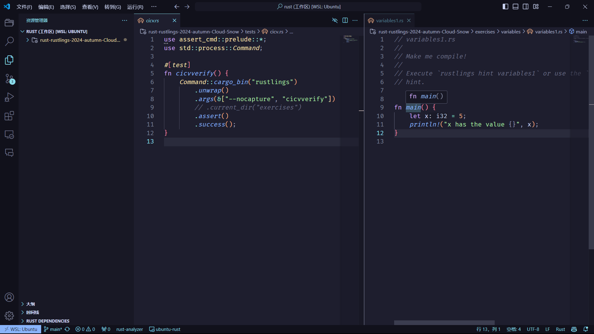
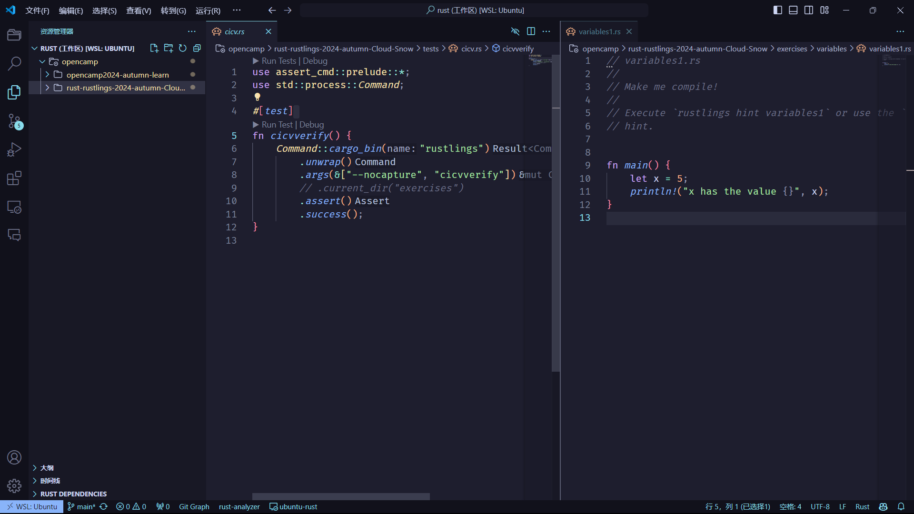
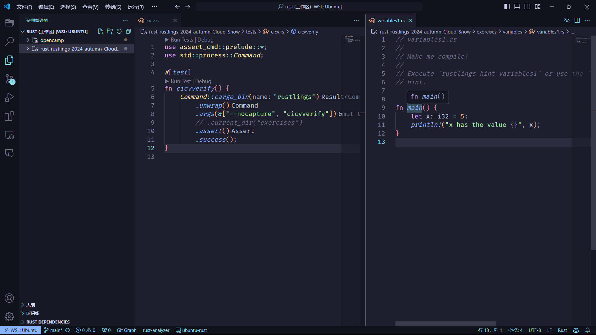

# opencamp2024-autumn-learn 
## 概述
- [训练营官网](https://opencamp.cn/os2edu/camp/2024fall)
- [训练营介绍](https://github.com/LearningOS)
- [常见问题](https://opencamp.cn/os2edu/bbs/1382)

**课程安排**


## 第一阶段 Rust & Rustlings
### 资料
- [Rust 程序设计语言 中文版](https://rustwiki.org/zh-CN/book/title-page.html)
### 仓库
- [rustlings仓库][rustlings]

[rustlings]:https://github.com/LearningOS/rust-rustlings-2024-autumn-Cloud-Snow

### 2024/09/29
---
#### 进展
77/110
#### 事件
今天观看了训练营的开营启动会，了解到要记录自己的学习情况，因此创建了这个仓库以记录学习日常。

我在今天之前就已经搭建好了rustlings环境，并提前开始rust的学习，目前已经进行到第77题，正在学习smart_pointers。

这里记录下之前遇到的问题，目前已解决

#### 问题1
- 构建rustlings环境时，[rustlings仓库][rustlings]README文档有以下这段话
> /home/{uername}/.cargo/bin/rustlings must be run from the rustlings directory<br>
Try `cd rustlings/`!

- 但我根据文档操作后却提示
> 进入clone下来的目录下的`exercises`文件夹，执行`rustlings watch`依次查看完成情况，并依次完成对应的练习。

- 然而我在仓库中并没有找到`rustlings`目录，后来猛然发现这个仓库的根目录其实就是`rustlings`目录，于是我便在根目录下执行`rustlings watch`，果然成功。

- **总结**：我怀疑README文档有误，不应该进入`exercises`文件夹，应该直接在根目录下执行命令。

#### 问题2
- 训练营网站的[排行榜](https://opencamp.cn/os2edu/camp/2024fall/stage/1?tab=rank)只显示github名字，不显示真实姓名等信息。
- **解决方法：** 完善训练营账号资料信息，填写github账号名字。

### 2024/09/30
---
#### 进展
81/110

#### 事件
- 帮助同学配置了rustlings环境，同时发现了一个奇怪的问题。
- 下载了Markdown Preview插件，感觉还挺好用。

#### 学习内容
- 学习了智能指针和并发操作，了解到需要修改数据时使用`Arc::new(Mutex::new(...))`，只读数据数据的话用`Arc::new(...)`就行。
- Cow（Clone on Write）是一种智能指针，用于在需要时进行克隆。它可以在借用和拥有之间切换，从而在性能和内存使用之间取得平衡，定义如下：
``` rust
enum Cow<'a, B: ?Sized + 'a>
where
    B: ToOwned,
{
    Borrowed(&'a B),
    Owned(<B as ToOwned>::Owned),
}
```
- **Borrowed**：表示一个借用的引用。
**Owned**：表示一个拥有的值。


#### 问题1
- 今天遇到了一个很奇怪的问题，以下截图中左侧为`tests/cicv.rs`文件，右侧是`exercises/varibles1.rs`。
- 当我只把rustlings添加到vscode工作区后，analyzer可以分析exercises中的文件，却不能分析tests和src中的文件。
> 
- 当我只把rustlins父目录添加到vscode工作区后，anlyzer又只可以分析tests和src中的文件，而不能分析exercises中的文件。
> 
- 只有我把两个文件夹都加入工作区，analyzer才能两者都能分析。
> 
- 但是这样就会导致每次打开工作区，rustlings项目就会被nanalyzer重复分析，问题我已经发布在了[训练营问答网站](https://opencamp.cn/os2edu/bbs/1385)，希望能有解决办法。(目前已解决)

### 2024/10/01
#### 进展
93/110
#### 事件
- 今日<font color=red>国庆</font>，祝祖国母亲75岁生日快乐！:satisfied:
#### 学习内容
- 更加细致地了解了rust是如何实现线程间通信
- 了解了宏的基本概念和用法
- 体验了clippy工具的功能
- 学习了如何在rust中进行类型转换